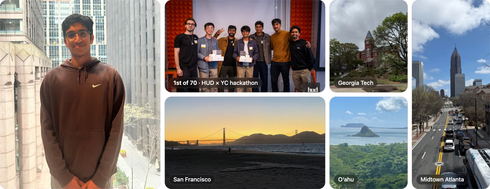
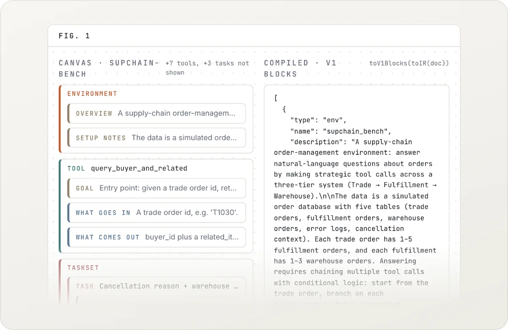
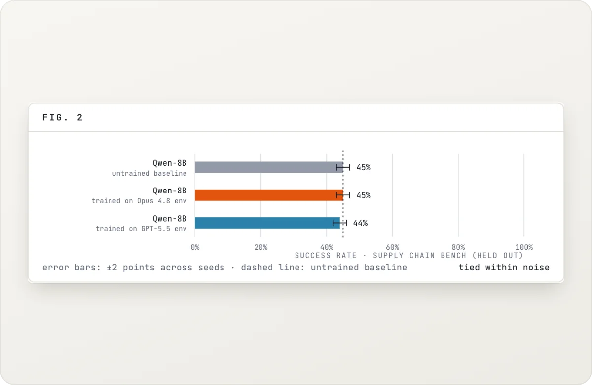
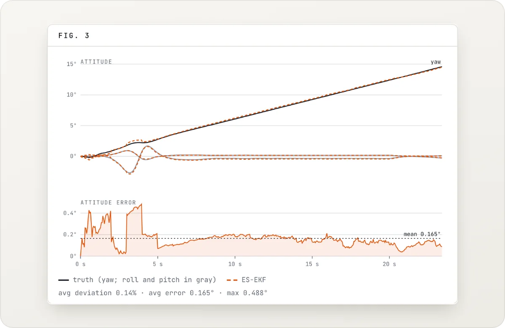
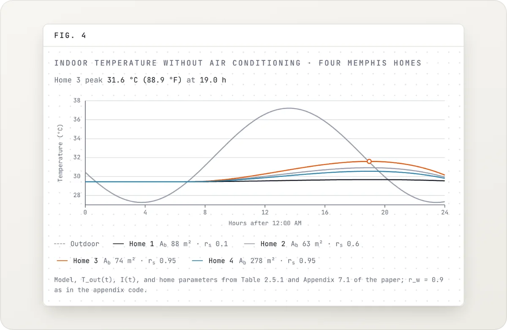
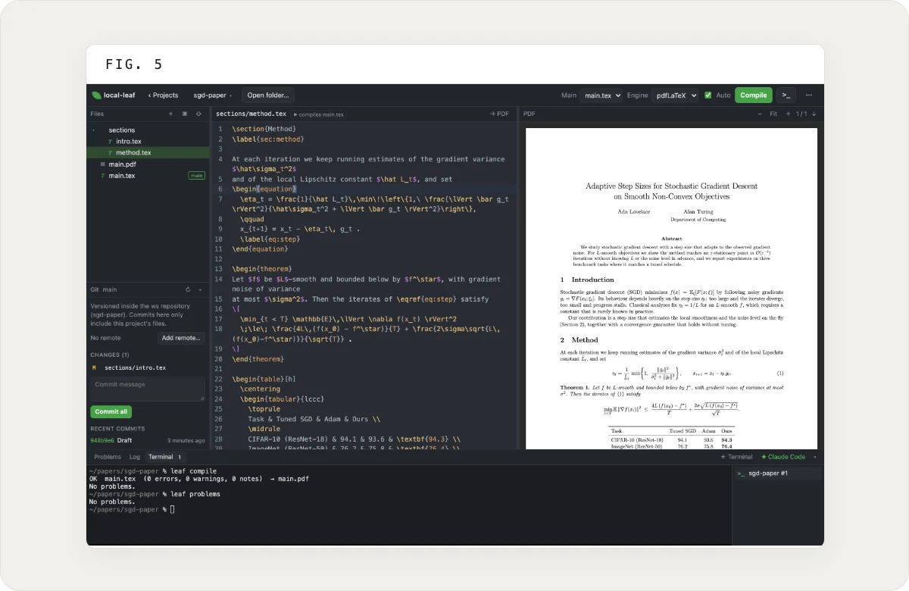
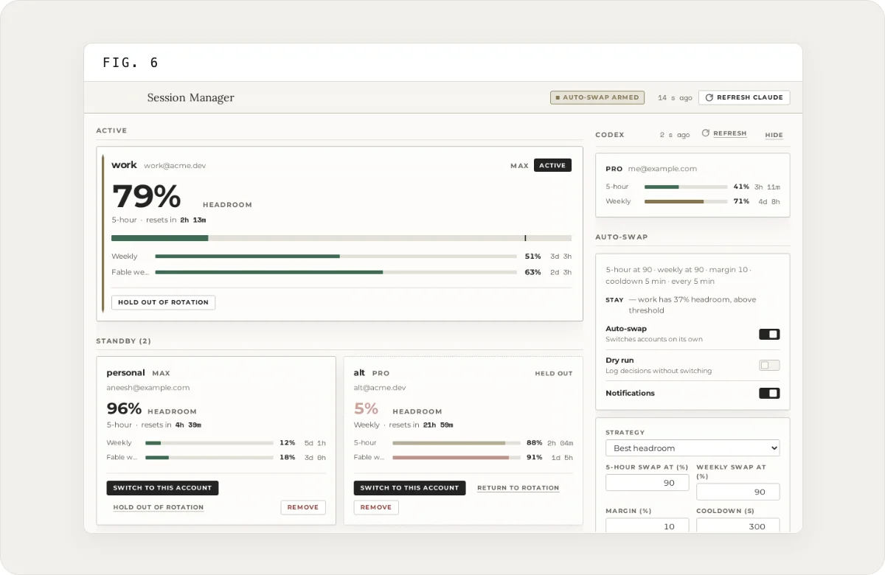
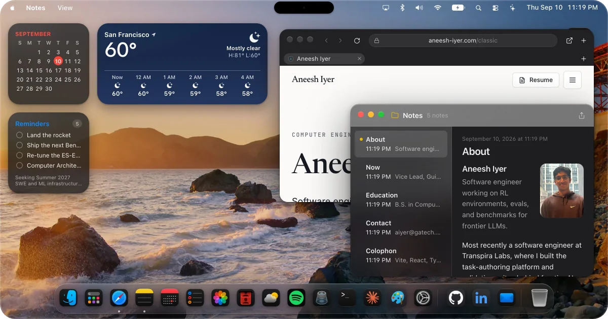

# Aneesh Iyer

**Software engineer working on RL environments, evals, and benchmarks for frontier LLMs** 
Computer Engineering at Georgia Tech · Vice Lead, GNC at GT Propulsive Landers

🔭 &nbsp;Seeking **Summer 2027** SWE and ML infrastructure internships

## 👋 About

I'm a Computer Engineering student at Georgia Tech (Cybersecurity and Systems/Architecture threads, 4.0 GPA, graduating May 2028). I build the environments, tasks, and graders that frontier models are trained and evaluated on, most recently at [Transpira Labs](https://www.transpiralabs.com/) and before that at Nuntius (YC S25). Outside of that, I write the state estimation for a self-landing rocket at [GT Propulsive Landers](https://github.com/Propulsive-Landers-GT).

## 💼 Experience

<table>
<tr>
<td width="76" align="center"></td>
<td valign="top">
<b><a href="https://www.transpiralabs.com/">Transpira Labs</a></b> 
<i>Software Engineer</i> 
Built the task-authoring platform that 40+ subject-matter experts used to produce frontier GDPval training data, a go-to-market platform that landed 5 pilot partners, and a sandbox replicating a 3PL's full operational stack for end-to-end testing.
</td>
<td align="right" valign="top">
May&nbsp;&#8288;–&#8288;&nbsp;Aug&nbsp;2026 
<i>Atlanta,&nbsp;GA</i>
</td>
</tr>
<tr>
<td width="76" align="center"></td>
<td valign="top">
<b>Nuntius (YC S25)</b> 
<i>Software Engineer</i> 
Directed a team of 8 engineers on a $50K project evaluating conversational tool-use LLM agents, and produced 300+ adversarial tasks across 5+ RL environments with automated graders and custom rewards.
</td>
<td align="right" valign="top">
Sep&nbsp;2025&nbsp;&#8288;–&#8288;&nbsp;Apr&nbsp;2026 
<i>Remote</i>
</td>
</tr>
<tr>
<td width="76" align="center"></td>
<td valign="top">
<b><a href="https://github.com/Propulsive-Landers-GT">GT Propulsive Landers</a></b> 
<i>Vice Lead, Guidance, Navigation, and Controls</i> 
Built a 16-state error-state EKF in Rust that fuses IMU, GPS, and magnetometer data, and automated PID tuning for a 1.8 kN engine simulation.
</td>
<td align="right" valign="top">
Jan&nbsp;2026&nbsp;&#8288;–&#8288;&nbsp;present 
<i>Atlanta,&nbsp;GA</i>
</td>
</tr>
<tr>
<td width="76" align="center"></td>
<td valign="top">
<b>Science Olympiad National Team</b> 
<i>Open-source maintainer and volunteer</i> 
Maintain <a href="https://github.com/toebes/ciphers">Codebusters</a>, the cipher platform used by 1,000+ coaches and volunteers nationwide, and help run exams for 2,000+ students at state and national tournaments.
</td>
<td align="right" valign="top">
Aug&nbsp;2025&nbsp;&#8288;–&#8288;&nbsp;present
</td>
</tr>
</table>

## 🚀 Featured work

<table>
<tr>
<td width="50%" valign="top">

<h3>Build: Scratch for RL Environments</h3>
🥇 <b>1st of 70</b>, $50K+ in prizes at the HUD × Y Combinator Frontier/RSI RL Environments Hackathon.  
A Scratch-style builder that compiles plain-language block trees into runnable RL environments, so anyone can evaluate models and launch training runs without writing code.  
<a href="https://build.transpiralabs.com/">Demo</a> · <a href="https://github.com/Transpira-Labs/build">Code</a> · <a href="https://www.aneesh-iyer.com/projects/build-rl-environments">Case study</a>
</td>
<td width="50%" valign="top">

<h3>Benchception</h3>
🧪 <b>Under 1% lift</b>: authoring good RL environments is genuinely hard.  
Which frontier model builds the best RL environments? Each model authors an environment from the same spec and trains a Qwen-8B student on it; a held-out benchmark that no model sees decides the winner.  
<a href="https://www.aneesh-iyer.com/projects/benchception">Case study</a>
</td>
</tr>
<tr>
<td width="50%" valign="top">

<h3>Propulsive Landers GNC</h3>
🎯 <b>0.14%</b> average deviation from simulated ground truth (0.17° attitude error).  
A 16-state error-state Kalman filter in Rust for a self-landing rocket. Magnetometer fusion makes yaw observable, and process noise comes from the VN-200 IMU datasheet.  
<a href="https://github.com/Propulsive-Landers-GT/navigation/tree/main/AttitudeEstimation/rust-ekf">Code</a> · <a href="https://www.aneesh-iyer.com/projects/propulsive-landers-gnc">Case study</a>
</td>
<td width="50%" valign="top">

<h3>M3 Math Modeling Champion</h3>
🏆 <b>1st of 794 teams</b> and the $20,000 grand prize in the MathWorks Math Modeling Challenge.  
Modeled Memphis heat resilience and electricity demand, quantified heat vulnerability across 27 zip codes, and co-authored a paper in SIAM Undergraduate Research Online.  
<a href="https://doi.org/10.1137/25S1777554">Paper</a> · <a href="https://www.aneesh-iyer.com/projects/m3-math-modeling-champion">Case study</a>
</td>
</tr>
</table>

## 🧩 Also built

<table>
<tr>
<td width="50%" valign="top">

<h3>🍃 local-leaf</h3>
<b>Overleaf, offline:</b> your own TeX, no compile timeout, and AI agents in the loop.  
An open-source LaTeX editor that works like Overleaf but runs on your Mac and compiles with MacTeX: live PDF with SyncTeX, Overleaf import, Git, a built-in terminal, and a <code>leaf</code> CLI that lets Claude Code edit and compile your paper while you watch.  
<a href="https://github.com/aneesh-iyer29/local-leaf">Code</a> · <a href="https://aneesh-iyer29.github.io/local-leaf/">Site</a>
</td>
<td width="50%" valign="top">

<h3>🔄 Session Manager for Claude Code</h3>
<b>Switches Claude Code accounts</b> before a 5-hour or weekly usage limit hits.  
A macOS menu bar app that tracks the usage limits of every Claude Pro and Max account you have, moves Claude Code to the one with the most headroom, and texts you over iMessage when a session is waiting on you.  
<a href="https://github.com/aneesh-iyer29/claude-session-manager">Code</a> · <a href="https://aneesh-iyer29.github.io/claude-session-manager/">Site</a> · <a href="https://github.com/aneesh-iyer29/claude-session-manager/releases/latest">Download</a>
</td>
</tr>
<tr>
<td width="50%" valign="top">

</td>
<td width="50%" valign="top">
🖥️ <b><a href="https://www.aneesh-iyer.com/">aneesh-iyer.com</a></b> 
My site is a macOS-style desktop in the browser, and an iPhone Home Screen on phones: Finder, Terminal, Photos, Spotlight, and an Ask app that answers questions and builds small web apps.
</td>
</tr>
</table>

## 🧰 Toolbox

<picture>
  <source media="(prefers-color-scheme: dark)" srcset="assets/skills-dark.svg">
  
</picture>

**AI/ML:** RL environments · reward modeling · LLM evaluation and benchmarking · RLVR/GRPO · HUD SDK · NVIDIA NeMo Gym 
**Systems:** RISC-V · embedded systems · control systems · sensor fusion

## 📄 Resume

The latest version lives in this repo: **[Aneesh_Iyer_Resume.pdf](./Aneesh_Iyer_Resume.pdf)**, built from [main.tex](./main.tex), which syncs from Overleaf.

Photos are from the Photos app on <a href="https://www.aneesh-iyer.com/">aneesh-iyer.com</a>.

